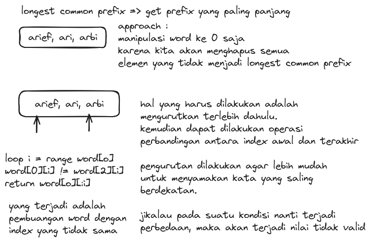
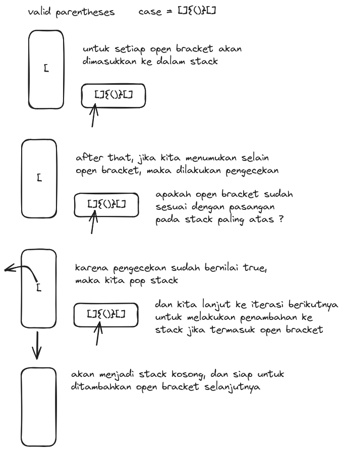

### 1.  Longest Common Prefix 

[code](longest_common_prefix_test.go)

Write a function to find the longest common prefix string amongst an array of strings.

If there is no common prefix, return an empty string "".

Example 1:

`Input`: strs = ["flower","flow","flight"]

`Output`: "fl"

Example 2:

`Input`: strs = ["dog","racecar","car"]

`Output`: ""

`Explanation`: There is no common prefix among the input strings.

### Explanation Algorithm

### 2. Valid Parentheses 

Given a string s containing just the characters '(', ')', '{', '}', '[' and ']', determine if the input string is valid.

An input string is valid if:
1. Open brackets must be closed by the same type of brackets. 
2. Open brackets must be closed in the correct order. 
3. Every close bracket has a corresponding open bracket of the same type.

Example 1:

`Input`: s = "()"
`Output`: true

Example 2:

`Input`: s = "()[]{}"
`Output`: true

Example 3:

`Input`: s = "(]"
`Output`: false

