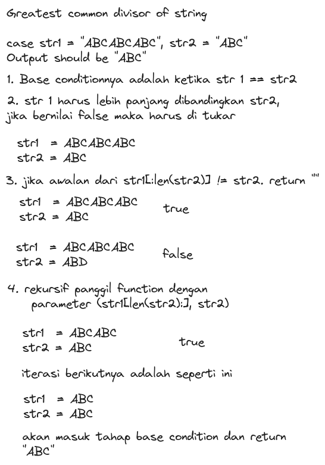
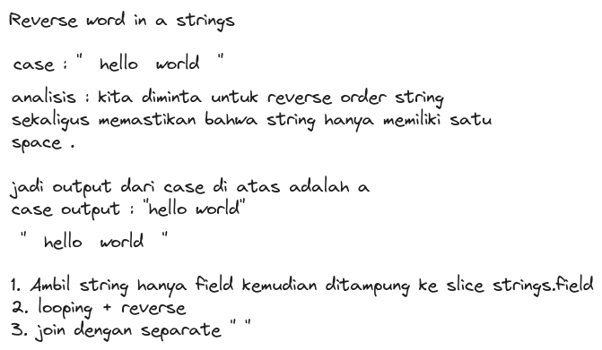

### 1. Greatest Common Divisor of Strings

[code](gcd_test.go)

For two strings `s` and `t`, we say "`t` divides `s`" if and only if `s = t + t + t + ... + t + t` (i.e., t is concatenated with itself one or more times).

Given two strings `str1` and `str2`, return the largest string `x` such that `x` divides both `str1` and `str2`.

Example 1:

`Input`: str1 = "ABCABC", str2 = "ABC"

`Output`: "ABC"

Example 2:

`Input`: str1 = "ABABAB", str2 = "ABAB"

`Output`: "AB"

Example 3:

`Input`: str1 = "LEET", str2 = "CODE"

`Output`: ""

#### explanation

### 2. Reverse Word in a String

[code](reverse_words_test.go)

Given an input string `s`, reverse the order of the words.

A word is defined as a sequence of non-space characters. The words in `s` will be separated by at least one space.

Return a string of the words in reverse order concatenated by a single space.

Note that `s` may contain leading or trailing spaces or multiple spaces between two words. The returned string should only have a single space separating the words. Do not include any extra spaces.

Example 1:

`Input`: s = "the sky is blue"

`Output`: "blue is sky the"

Example 2:

`Input`: s = "  hello world  "

`Output`: "world hello"

`Explanation`: Your reversed string should not contain leading or trailing spaces.

Example 3:

`Input`: s = "a good   example"

`Output`: "example good a"

`Explanation`: You need to reduce multiple spaces between two words to a single space in the reversed string.

#### Explanation
