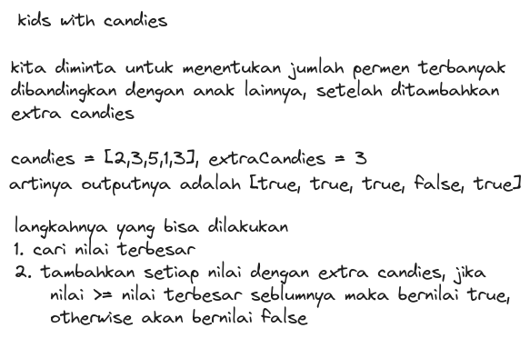

### Kids With the Greatest Number of Candies

[code](kids_with_cadies_test.go)

There are `z` kids with candies. You are given an integer array `candies`, where each `candies[i]` represents the number of candies the `i^th` kid has, and an integer `extraCandies`, denoting the number of extra candies that you have.

Return a boolean array `result` of length `n`, where `result[i]` is `true` if, after giving the `i^th` kid all the `extraCandies`, they will have the greatest number of candies among all the kids, or `false` otherwise.

Note that **multiple** kids can have the **greatest** number of candies.

Example 1:

`Input`: candies = [2,3,5,1,3], extraCandies = 3

`Output`: [true,true,true,false,true]

`Explanation`: If you give all extraCandies to:
- Kid 1, they will have 2 + 3 = 5 candies, which is the greatest among the kids.
- Kid 2, they will have 3 + 3 = 6 candies, which is the greatest among the kids.
- Kid 3, they will have 5 + 3 = 8 candies, which is the greatest among the kids.
- Kid 4, they will have 1 + 3 = 4 candies, which is not the greatest among the kids.
- Kid 5, they will have 3 + 3 = 6 candies, which is the greatest among the kids.

Example 2:

`Input`: candies = [4,2,1,1,2], extraCandies = 1

`Output`: [true,false,false,false,false]

`Explanation`: There is only 1 extra candy.
Kid 1 will always have the greatest number of candies, even if a different kid is given the extra candy.

Example 3:

`Input`: candies = [12,1,12], extraCandies = 10

`Output`: [true,false,true]

#### Explanation Algorithm

### 2. Merge Strings Alternately

You are given two strings `word1` and `word2`. Merge the strings by adding letters in alternating order, starting with `word1`. If a string is longer than the other, append the additional letters onto the end of the merged string.

Return the merged string.

Example 1:

`Input`: word1 = "abc", word2 = "pqr"

`Output`: "apbqcr"

`Explanation`: The merged string will be merged as so:
word1:  a   b   c
word2:    p   q   r
merged: a p b q c r

Example 2:

`Input`: word1 = "ab", word2 = "pqrs"

`Output`: "apbqrs"

`Explanation`: Notice that as word2 is longer, "rs" is appended to the end.
word1:  a   b
word2:    p   q   r   s
merged: a p b q   r   s

Example 3:

`Input`: word1 = "abcd", word2 = "pq"

`Output`: "apbqcd"

Explanation: Notice that as word1 is longer, "cd" is appended to the end.
word1:  a   b   c   d
word2:    p   q
merged: a p b q c   d
