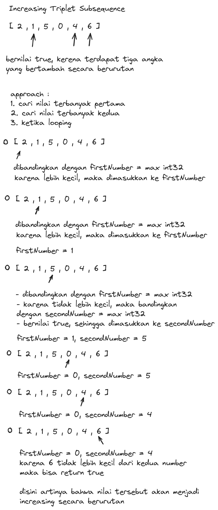
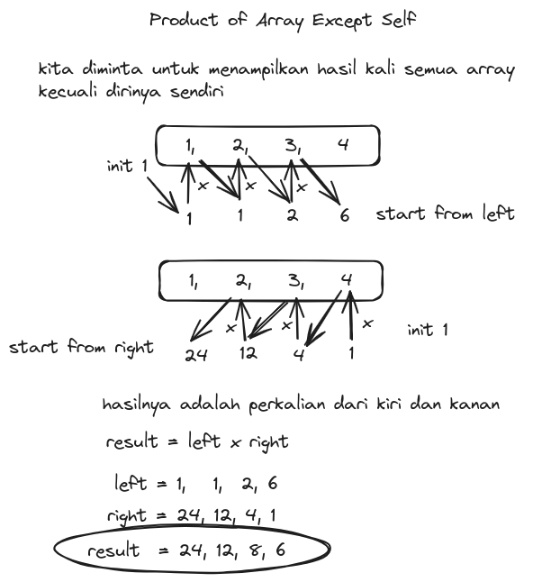

### 1. Increasing Triplet Subsequence

[code]()

Given an integer array `nums`, return `true` if there exists a triple of indices `(i, j, k)` such that `i < j < k` and `nums[i] < nums[j] < nums[k]`. If no such indices exists, return `false`.

Example 1:

`Input`: nums = [1,2,3,4,5]

`Output`: true

`Explanation`: Any triplet where i < j < k is valid.
Example 2:

`Input`: nums = [5,4,3,2,1]

`Output`: false

`Explanation`: No triplet exists.
Example 3:

`Input`: nums = [2,1,5,0,4,6]

`Output`: true

`Explanation`: The triplet (3, 4, 5) is valid because nums[3] == 0 < nums[4] == 4 < nums[5] == 6.

### Explanation Algorithm

### 2. Product of Array Except Self

[code](product_except_self_test.go)

Given an integer array `nums`, return an array `answer` such that `answer[i]` is equal to the product of all the elements of `nums` except `nums[i]`.

The product of any prefix or suffix of nums is guaranteed to fit in a 32-bit integer.

You must write an algorithm that runs in `O(n)` time and without using the division operation.

Example 1:

`Input`: nums = [1,2,3,4]

`Output`: [24,12,8,6]

Example 2:

`Input`: nums = [-1,1,0,-3,3]

`Output`: [0,0,9,0,0]

