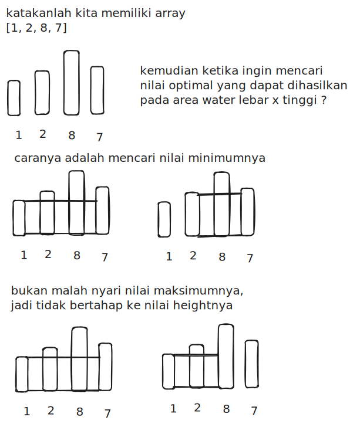
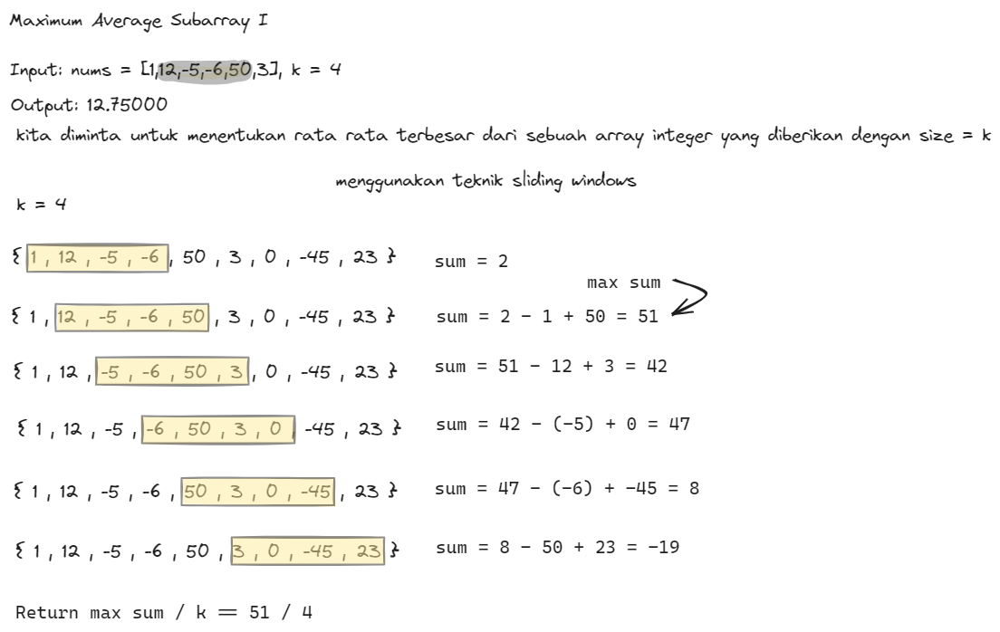

### 1. Container With Most Water

[code](max_area_test.go)

You are given an integer array `height` of length `n`. There are `n` vertical lines drawn such that the two endpoints of the `i^th` line are `(i, 0)` and `(i, height[i])`.

Find two lines that together with the x-axis form a container, such that the container contains the most water.

Return the maximum amount of water a container can store.

Notice that you may not slant the container.

Example 1:

`Input`: height = [1,8,6,2,5,4,8,3,7]

`Output`: 49

`Explanation`: The above vertical lines are represented by array [1,8,6,2,5,4,8,3,7]. In this case, the max area of water (blue section) the container can contain is 49.

Example 2:

`Input`: height = [1,1]
`Output`: 1

### Explanation Algorithm 

### 2. Maximum Average Subarray I

[code](find_max_average_test.go)

You are given an integer array `nums` consisting of `n` elements, and an integer `k`.

Find a contiguous subarray whose **length is equal to** `k` that has the maximum average value and return this value. Any answer with a calculation error less than `10^-5` will be accepted.

Example 1:

`Input`: nums = [1,12,-5,-6,50,3], k = 4

`Output`: 12.75000

`Explanation`: Maximum average is (12 - 5 - 6 + 50) / 4 = 51 / 4 = 12.75

Example 2:

`Input`: nums = [5], k = 1

`Output`: 5.00000
 
### Explanation Algorithm 
